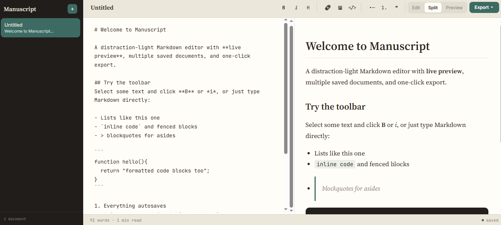

# 📝 Manuscript — Distraction-Light Markdown Editor & Live Preview Studio

[](https://github.com/)
[](https://opensource.org/licenses/MIT)
[](https://github.com/)

> **"Focused writing, instantaneous parsing."**

**Manuscript** is a modern, client-side Markdown editor engineered for developers, technical writers, and content creators. Featuring a warm paper workspace layout, live split-pane HTML rendering, multi-document sidebar navigation, quick-formatting toolbars, real-time word/read-time statistics, and local autosaving, it turns raw text creation into a seamless publishing workflow.

[Explore Live Workspace](https://yourusername.github.io/manuscript) • [Report a Bug](https://github.com/yourusername/manuscript/issues) • [Request Feature](https://github.com/yourusername/manuscript/issues)

---

## 📸 Interface Preview & Gallery

### Split-Pane Workspace & Rendered Live Preview
<!-- Replace this placeholder URL with your real cropped screenshot once uploaded to GitHub -->


### 🎥 Live Studio Walkthrough
> **Watch Manuscript in action:** Click the workspace preview below to see real-time syntax parsing, mode toggles (`Edit`, `Split`, `Preview`), document creation, and export workflows.

[](https://github.com/yourusername/manuscript "Watch Walkthrough")

---

## ✨ Core Engineering & Feature Set

* **⚡ Synchronous Split-Pane Rendering:** Instant DOM parsing converts raw Markdown (headers, lists, inline code, blockquotes, code blocks) into styled HTML without page lag.
* **🎛️ Interactive Formatting Toolbar:** Direct-action control nodes for **Bold** (`B`), *Italics* (`i`), Headers (`H`), Links, Images, Code Blocks (`</>`), and Ordered/Unordered Lists.
* **📑 Multi-Document Workspace Management:** Sidebar file manager allowing creators to add, rename, and toggle between multiple active drafts seamlessly.
* **👁️ Flexible Viewport Modes:** One-click layout toggles between `Edit` (focus text editor), `Split` (side-by-side editing & preview), and `Preview` (full rendered document view).
* **📊 Micro-Metrics & Autosaving:** Real-time word count tracking (`92 words`), estimated reading speed calculations (`1 min read`), active status indicators (`● saved`), and `localStorage` persistence.
* **📥 Multi-Format Export Options (`Export ▾`):** Integrated export engine supporting file downloads as raw `.md` documents or compiled HTML assets.

---

## 🛠 Tech Stack Matrix

| Module | Selected Technologies | Architectural Mandate |
| :--- | :--- | :--- |
| **Structure** | HTML5 | Accessible editor textareas, toolbar groups, and preview container trees |
| **Styling** | CSS3 Grid / Flexbox | Custom warm cream paper theme, custom scrollbars, typography scales |
| **Engine** | Vanilla JavaScript | Markdown syntax parsing engine, input observers, `localStorage` synchronization, file synthesis |

---

## 📦 Rapid Local Setup

### 1. Repository Clone
```bash
git clone [https://github.com/yourusername/manuscript.git](https://github.com/yourusername/manuscript.git)
cd manuscript
